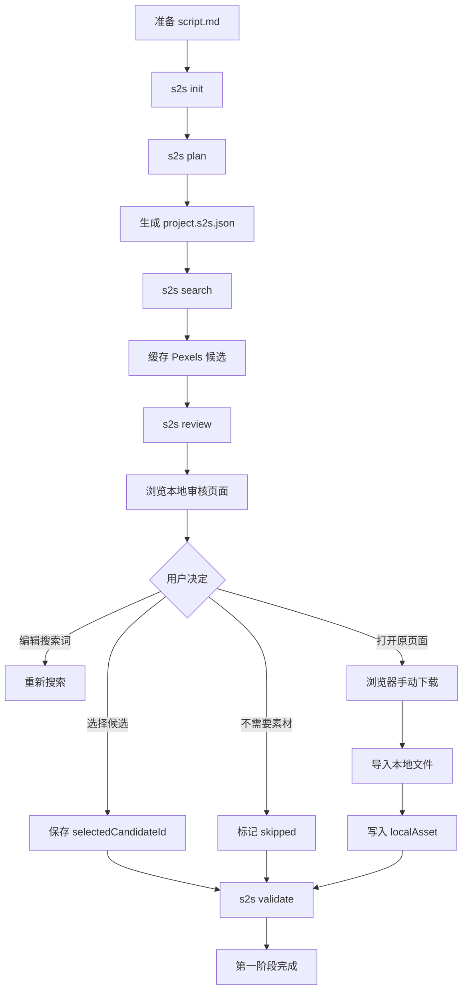
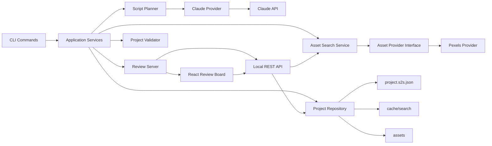

# Speech-to-Scene 第一阶段 Demo 执行计划

> 项目阶段：V0.1 / Script-to-Assets Demo
> 项目性质：本地优先、开源、人在回路中的口播素材规划工具
> 核心链路：**文稿 → 视觉分段 → 素材搜索 → 人工审核 → 手动下载并关联本地素材**
> 本文用途：作为项目总设计文档，直接交给 Claude Code 分阶段开发
> 最后更新：2026-07-13

---

## 0. 执行摘要

Speech-to-Scene 的长期方向，是让口播内容能够自动转化为视觉场景。但对于个人开发者而言，第一阶段不应处理视频渲染、实时语音识别、复杂剪辑或直播。

第一阶段只解决一个具体问题：

> 用户已经有一份口播稿，但不知道哪些内容需要素材、应该搜索什么素材，也不愿逐句手工搜索。系统负责分析文稿、生成视觉分镜、搜索候选图片和视频；用户在本地审核页面中选择、跳过或替换素材，并手动下载后关联到对应场景。

第一阶段的最终产物不是 MP4，而是一个可复用、可审计的项目目录：

```text
my-video/
├── script.md
├── project.s2s.json
├── assets/
│   ├── scene-001/
│   ├── scene-002/
│   └── ...
├── cache/
│   └── search/
└── logs/
```

其中 `project.s2s.json` 是整个项目的核心协议。第二阶段的视频对齐与渲染，也必须读取这份文件，而不是重新分析所有内容。

### V0.1 必须完成

1. 读取 Markdown/TXT 口播稿。
2. 使用 Claude API 将文稿拆成语义场景。
3. 判断每个场景是否需要视觉素材。
4. 为需要素材的场景生成中英文搜索词。
5. 通过 Pexels API 搜索图片和视频候选。
6. 将候选结果保存到本地项目文件。
7. 启动本地审核页面。
8. 支持选择候选、跳过场景、编辑搜索词、重新搜索。
9. 支持打开素材原始页面，由用户手动下载。
10. 支持用户将下载好的文件导入并关联到场景。
11. 检查项目是否已经具备进入第二阶段的基本条件。

### V0.1 明确不做

- 不输出完整视频。
- 不处理真人口播视频。
- 不做 ASR、字幕和时间轴对齐。
- 不自动下载第三方素材。
- 不调用 Google 图片、百度图片等非结构化搜索结果。
- 不做 AI 生图或 AI 视频生成。
- 不做云端账户、数据库、登录、支付。
- 不做移动端。
- 不做复杂时间轴编辑器。
- 不做实时录制和实时画面生成。
- 不做多素材平台聚合，首版只接 Pexels 与本地文件。

如果 Claude 在开发过程中试图加入上述内容，应立即停止扩张，回到本计划。

---

# 1. 项目背景

## 1.1 用户问题

很多刚开始制作知识型口播视频的用户，已经能够写出内容，也愿意面对镜头，但最终视频通常只有：

- 一张人脸；
- 自动字幕；
- 一段背景音乐；
- 少量随意插入的图片。

真正耗费时间的步骤通常不是录制，而是：

1. 判断哪句话需要素材；
2. 判断应该使用图片、视频、标题还是结构化信息；
3. 为抽象观点寻找合适的搜索词；
4. 在大量候选素材中进行筛选；
5. 记录素材对应哪一段文稿；
6. 保存素材来源与授权信息；
7. 为后续剪辑重新整理文件。

现有流程高度依赖人工记忆，素材、文稿和场景之间缺少统一结构。

## 1.2 第一阶段的产品价值

第一阶段不承诺“自动完成视频”，而是承诺：

> 将无结构的口播文稿，转化为一份经过组织的视觉制作清单。

用户获得的核心价值包括：

- 不需要逐句思考搜索词；
- 不会给每一句话机械配图；
- 能够一次性看到整条视频的视觉节奏；
- 能够人工控制最终素材；
- 能够追踪素材来源；
- 为后续自动合成建立结构化数据基础。

## 1.3 开源项目定位

项目定位为：

> **面向真人口播创作者的、本地优先、人在回路中的 AI 素材规划工具。**

三个关键词：

### 真人口播优先

不是批量生成无人出镜的营销视频，而是增强真实创作者的表达。

### 人在回路

AI负责分析、搜索和初筛；人负责审美、事实判断和最终选择。

### 本地优先

文稿、项目文件和本地素材默认保存在用户电脑，不依赖云端工作区。

## 1.4 与“自动 B-roll 工具”的差异

本项目不应只做关键词匹配。

系统需要理解文稿片段在论述中的作用：

| 文稿功能             | 推荐视觉                               |
| -------------------- | -------------------------------------- |
| 提出核心问题         | 大字标题或人物主体                     |
| 个人经历与情绪表达   | 保持人物主体                           |
| 介绍人物、地点、产品 | 图片或短视频                           |
| 列举多个原因         | 结构化信息，第一阶段可先记录为未来能力 |
| 比较两个概念         | 对比结构，第一阶段可搜索两组素材       |
| 描述历史发展         | 时间线，第一阶段先形成搜索建议         |
| 引用数据             | 图表，第一阶段不自动生成               |
| 软件操作             | 截图或用户自有录屏                     |
| 结论与号召           | 人物主体或大字观点                     |

第一阶段只负责识别这些类型，并处理其中可由库存图片、库存视频和本地文件支持的部分。

---

# 2. 第一阶段目标与验收标准

## 2.1 核心用户故事

### 用户故事 A：创建项目

作为口播创作者，我希望输入一份 Markdown 文稿并创建项目，以便后续所有素材都围绕同一份结构化项目管理。

### 用户故事 B：获得视觉分镜

作为不会剪辑的用户，我希望系统告诉我哪些段落需要画面辅助，以及推荐使用什么视觉类型。

### 用户故事 C：搜索素材

作为用户，我希望系统自动为每个需要素材的场景生成中英文搜索词，并展示候选图片和视频。

### 用户故事 D：人工审核

作为用户，我希望能够选择一个候选、跳过该场景、编辑搜索词或重新搜索，而不是接受 AI 的唯一决定。

### 用户故事 E：手动下载与关联

作为用户，我希望打开原素材页面，手动下载文件后，将本地文件关联到对应场景。

### 用户故事 F：检查完整性

作为用户，我希望系统告诉我哪些场景仍未处理、哪些素材缺少来源、哪些文件不存在。

## 2.2 Demo 成功标准

使用一份 500～2000 个中文字符的口播稿，能够完成：

1. 一条命令创建项目。
2. 一条命令生成 5～20 个语义场景。
3. 所有场景具有清晰、连续且不重叠的原文范围。
4. 系统不会默认给每个场景都搜索素材。
5. 需要库存素材的场景至少生成 2 条搜索查询。
6. 每个查询可以获得可展示的候选结果，或明确记录“无结果”。
7. 审核页面可以完整加载项目。
8. 用户的选择在刷新页面后仍然存在。
9. 用户可以打开 Pexels 原始页面。
10. 用户可以导入下载好的本地文件。
11. `s2s validate` 能输出可理解的错误和警告。
12. 整个流程不需要手动编辑 JSON。

## 2.3 Demo 发布条件

满足以下条件才发布 V0.1：

- Windows、macOS、Linux 至少通过自动化测试中的路径与文件系统逻辑。
- 无 API Key 时能给出明确错误，不崩溃。
- Pexels 无结果时页面仍正常显示。
- Claude 输出异常时不会写入损坏的项目文件。
- 项目文件写入采用原子替换。
- API Key、文稿全文和本地文件路径不会出现在普通日志中。
- README 可以让新用户从克隆仓库走到打开审核页面。
- 至少提供一个完全可运行的示例项目和固定测试数据。

---

# 3. 产品工作流

## 3.1 用户操作流程



## 3.2 推荐命令

```bash
# 创建新项目
s2s init ./my-video --script ./script.md

# 使用 Claude 分析文稿
s2s plan ./my-video

# 搜索所有待搜索场景
s2s search ./my-video

# 启动本地审核页面
s2s review ./my-video

# 验证项目完整性
s2s validate ./my-video

# 查看项目状态
s2s status ./my-video
```

可选参数：

```bash
s2s plan ./my-video \
  --language zh-CN \
  --aspect-ratio 9:16 \
  --style knowledge \
  --force

s2s search ./my-video \
  --media photo,video \
  --per-query 8 \
  --orientation portrait

s2s review ./my-video \
  --port 3210 \
  --no-open
```

## 3.3 项目状态机

项目级状态：

```text
created
  ↓
planned
  ↓
searched
  ↓
reviewing
  ↓
assets_ready
```

场景级状态：

```text
unplanned
  ↓
not_needed | pending_search
                ↓
          candidates_ready
                ↓
    selected | skipped | local_attached
```

状态必须由程序根据字段推导，避免同时保存多个可能冲突的状态字段。只有确有必要时才持久化状态。

---

# 4. 技术架构

## 4.1 技术选型

### 运行时

- Node.js 24 LTS。
- TypeScript。
- ESM 模块。
- pnpm 管理依赖。

选择 Node.js 24 LTS，是为了使用当前长期支持版本，同时满足现代 Vite 的 Node.js 要求。

### 数据验证

- Zod 4。
- Zod Schema 作为数据结构的单一事实来源。
- 通过 Zod 推导 TypeScript 类型。
- 必要时从 Zod 导出 JSON Schema，供 Claude Structured Outputs 使用。

### LLM

- 官方 `@anthropic-ai/sdk`。
- 使用 Claude Structured Outputs。
- 模型名称从 `ANTHROPIC_MODEL` 环境变量读取，不在代码中永久写死。
- 使用 `ANTHROPIC_API_KEY`。
- 对 LLM 结果进行 Zod 二次验证。

### 素材搜索

- Pexels API。
- 图片与视频均通过官方 API 搜索。
- 首版不做自动下载。
- 必须保存来源、作者、原始页面、尺寸、比例等信息。
- 审核页面中显示 Pexels 归属说明。

### CLI

- Commander.js 或同等级轻量 CLI 库。
- 所有命令支持 `--help`。
- 退出码遵循 Unix 习惯。

### 本地审核页面

- React。
- Vite。
- 本地 Node 服务提供 API 和静态页面。
- 默认只绑定 `127.0.0.1`。
- 不需要数据库。

### 测试

- Vitest。
- 单元测试不访问真实网络。
- 使用固定 LLM 和 Pexels fixtures。
- 集成测试使用临时目录。

### 日志

- 使用结构化日志库或统一自定义 Logger。
- 默认输出简洁信息。
- `--verbose` 才输出调试信息。
- 严禁打印 API Key。

## 4.2 总体架构图



## 4.3 架构分层

### Domain 层

包含纯数据结构和规则：

- 项目 Schema；
- 场景 Schema；
- 素材候选 Schema；
- 视觉类型；
- 状态推导；
- 验证规则。

不得依赖：

- Claude SDK；
- Pexels；
- 文件系统；
- React；
- CLI。

### Application 层

组织用例：

- 创建项目；
- 规划文稿；
- 搜索素材；
- 更新用户选择；
- 导入本地素材；
- 验证项目。

Application 层通过接口调用外部能力。

### Infrastructure 层

实现外部能力：

- Anthropic Planner Provider；
- Pexels Asset Provider；
- JSON 文件 Project Repository；
- 本地文件存储；
- 日志；
- HTTP Server。

### Interface 层

面向用户：

- CLI；
- Review API；
- React Review Board。

## 4.4 关键架构原则

1. 核心数据结构不依赖 UI。
2. 核心功能不依赖 Claude Code Skill。
3. LLM 与素材平台都必须通过接口隔离。
4. 所有网络结果必须落盘缓存。
5. 项目必须能够离线重新打开。
6. 所有用户决定都写入项目文件。
7. 不在业务逻辑中散落文件路径。
8. 不让 React 组件直接修改磁盘。
9. 不让 LLM 返回任意未验证对象。
10. 第一阶段不引入数据库。

---

# 5. 仓库结构

第一阶段使用单仓库、单 Node package，避免过早采用复杂 Monorepo。

```text
speech-to-scene/
├── src/
│   ├── cli/
│   │   ├── index.ts
│   │   ├── commands/
│   │   │   ├── init-command.ts
│   │   │   ├── plan-command.ts
│   │   │   ├── search-command.ts
│   │   │   ├── review-command.ts
│   │   │   ├── validate-command.ts
│   │   │   └── status-command.ts
│   │   └── formatters/
│   │       ├── console-reporter.ts
│   │       └── error-reporter.ts
│   │
│   ├── domain/
│   │   ├── project-schema.ts
│   │   ├── scene-schema.ts
│   │   ├── asset-schema.ts
│   │   ├── visual-types.ts
│   │   ├── project-status.ts
│   │   └── validation-rules.ts
│   │
│   ├── application/
│   │   ├── create-project.ts
│   │   ├── plan-script.ts
│   │   ├── search-project-assets.ts
│   │   ├── update-scene.ts
│   │   ├── attach-local-asset.ts
│   │   ├── validate-project.ts
│   │   └── get-project-status.ts
│   │
│   ├── planner/
│   │   ├── planner-provider.ts
│   │   ├── anthropic-planner.ts
│   │   ├── planner-prompt.ts
│   │   └── planner-output-schema.ts
│   │
│   ├── providers/
│   │   ├── asset-provider.ts
│   │   ├── pexels/
│   │   │   ├── pexels-client.ts
│   │   │   ├── pexels-provider.ts
│   │   │   ├── pexels-mapper.ts
│   │   │   └── pexels-types.ts
│   │   └── fixture/
│   │       └── fixture-provider.ts
│   │
│   ├── infrastructure/
│   │   ├── project-repository.ts
│   │   ├── json-project-repository.ts
│   │   ├── atomic-write.ts
│   │   ├── file-store.ts
│   │   ├── cache-store.ts
│   │   ├── env.ts
│   │   └── logger.ts
│   │
│   ├── review/
│   │   ├── server.ts
│   │   ├── routes/
│   │   │   ├── project-routes.ts
│   │   │   ├── scene-routes.ts
│   │   │   ├── search-routes.ts
│   │   │   └── upload-routes.ts
│   │   └── security/
│   │       ├── path-safety.ts
│   │       └── upload-policy.ts
│   │
│   └── shared/
│       ├── errors.ts
│       ├── ids.ts
│       ├── result.ts
│       └── constants.ts
│
├── web/
│   ├── index.html
│   ├── src/
│   │   ├── main.tsx
│   │   ├── App.tsx
│   │   ├── api/
│   │   ├── components/
│   │   │   ├── SceneList.tsx
│   │   │   ├── SceneEditor.tsx
│   │   │   ├── CandidateGrid.tsx
│   │   │   ├── CandidateCard.tsx
│   │   │   ├── QueryEditor.tsx
│   │   │   ├── Attribution.tsx
│   │   │   └── LocalAssetPanel.tsx
│   │   ├── hooks/
│   │   ├── pages/
│   │   │   └── ReviewPage.tsx
│   │   └── styles/
│   └── vite.config.ts
│
├── tests/
│   ├── unit/
│   ├── integration/
│   ├── fixtures/
│   │   ├── scripts/
│   │   ├── planner/
│   │   ├── pexels/
│   │   └── projects/
│   └── helpers/
│
├── examples/
│   └── token-cost/
│       ├── script.md
│       └── expected/
│
├── templates/
│   └── project/
│
├── docs/
│   ├── PHASE1_DEMO_PLAN.md
│   ├── PROJECT_SCHEMA.md
│   ├── VISUAL_GRAMMAR.md
│   └── CONTRIBUTING.md
│
├── .claude/
│   ├── skills/
│   │   └── s2s-development/
│   │       └── SKILL.md
│   └── rules/
│       ├── typescript.md
│       ├── testing.md
│       └── architecture.md
│
├── CLAUDE.md
├── .env.example
├── .gitignore
├── eslint.config.js
├── prettier.config.js
├── package.json
├── pnpm-lock.yaml
├── tsconfig.json
├── tsconfig.node.json
├── vite.config.ts
├── vitest.config.ts
├── README.md
├── LICENSE
└── CHANGELOG.md
```

---

# 6. 核心数据模型

## 6.1 项目文件命名

固定使用：

```text
project.s2s.json
```

不要使用含义模糊的 `scene.json` 或 `data.json`。

## 6.2 顶层结构

```ts
type SpeechToSceneProject = {
  schemaVersion: "0.1";
  project: ProjectMeta;
  source: SourceDocument;
  generation: GenerationMeta;
  scenes: Scene[];
};
```

### `ProjectMeta`

```ts
type ProjectMeta = {
  id: string;
  title: string;
  createdAt: string;
  updatedAt: string;
  language: "zh-CN" | "en-US";
  aspectRatio: "9:16" | "16:9" | "1:1";
  style: "knowledge" | "story" | "commentary";
};
```

### `SourceDocument`

```ts
type SourceDocument = {
  path: string;
  sha256: string;
  encoding: "utf-8";
  rawTextLength: number;
};
```

`sha256` 用于检测文稿是否被外部修改。V0.1 不自动合并修改，只提示用户重新执行 `plan --force`。

### `GenerationMeta`

```ts
type GenerationMeta = {
  plannerProvider: "anthropic" | "fixture";
  model?: string;
  promptVersion: string;
  generatedAt: string;
};
```

不要保存 API Key、完整请求头或包含敏感信息的原始响应。

## 6.3 Scene 结构

```ts
type Scene = {
  id: string;
  order: number;

  sourceRange: {
    start: number;
    end: number;
  };

  text: string;
  summary: string;
  narrativeRole: NarrativeRole;

  visualPlan: {
    decision: VisualDecision;
    rationale: string;
    preferredMedia: PreferredMedia[];
    visualKeywords: string[];
  };

  search: {
    queries: SearchQuery[];
    candidates: AssetCandidate[];
    lastSearchedAt?: string;
  };

  review: {
    status: ReviewStatus;
    selectedCandidateId?: string;
    note?: string;
  };

  localAsset?: LocalAsset;
};
```

### `NarrativeRole`

```ts
type NarrativeRole =
  | "hook"
  | "question"
  | "claim"
  | "explanation"
  | "example"
  | "comparison"
  | "process"
  | "data"
  | "story"
  | "emotion"
  | "transition"
  | "conclusion"
  | "call_to_action";
```

### `VisualDecision`

```ts
type VisualDecision =
  | "speaker_only"
  | "stock_asset"
  | "title_card"
  | "structured_graphic"
  | "screen_capture"
  | "user_asset"
  | "none";
```

第一阶段只真正搜索 `stock_asset`。其他类型保留给未来阶段，但必须在审核板中清晰显示。

### `PreferredMedia`

```ts
type PreferredMedia = "photo" | "video";
```

### `SearchQuery`

```ts
type SearchQuery = {
  id: string;
  language: "zh" | "en";
  query: string;
  purpose: string;
  enabled: boolean;
};
```

### `ReviewStatus`

```ts
type ReviewStatus = "pending" | "candidates_ready" | "selected" | "skipped" | "local_attached";
```

### `LocalAsset`

```ts
type LocalAsset = {
  relativePath: string;
  originalFileName: string;
  mimeType: string;
  sizeBytes: number;
  sha256: string;
  importedAt: string;
  sourceCandidateId?: string;
};
```

## 6.4 AssetCandidate 结构

```ts
type AssetCandidate = {
  id: string;
  provider: "pexels";
  providerAssetId: string;
  mediaType: "photo" | "video";

  thumbnailUrl: string;
  previewUrl?: string;
  sourcePageUrl: string;

  width: number;
  height: number;
  durationSeconds?: number;
  orientation: "portrait" | "landscape" | "square";

  creator: {
    name: string;
    profileUrl?: string;
  };

  attribution: {
    text: string;
    providerName: "Pexels";
    providerUrl: string;
  };

  matchedQueryId: string;
  rank: number;
};
```

## 6.5 ID 规则

ID 必须稳定、可读、无随机漂移。

推荐：

```text
scene-001
scene-002

query-scene-001-en-01
candidate-pexels-photo-123456
```

文稿重新规划时可以重建 Scene ID，但必须显式要求 `--force`，避免覆盖人工审核结果。

## 6.6 Schema 版本

顶层必须有：

```json
{
  "schemaVersion": "0.1"
}
```

以后升级时引入：

```text
src/migrations/
├── migrate-0.1-to-0.2.ts
└── ...
```

V0.1 暂不实现迁移器，但项目读取时必须拒绝未知版本，并给出清晰错误。

---

# 7. LLM 规划设计

## 7.1 Planner 接口

```ts
export interface ScriptPlanner {
  plan(input: PlanScriptInput): Promise<PlanScriptOutput>;
}
```

```ts
type PlanScriptInput = {
  rawText: string;
  language: string;
  aspectRatio: string;
  style: string;
};
```

`PlanScriptOutput` 只包含场景规划，不包含项目元数据和本地路径。

## 7.2 Prompt 原则

系统提示必须强调：

1. 按语义单元分段，不按每句话机械分段。
2. 不要给每个场景都安排外部素材。
3. 个人经历、情绪、结论通常优先保留人物。
4. 抽象概念优先寻找可解释的具体视觉，而不是泛化科技图。
5. 不要为“成功”“未来”“努力”等抽象词生成廉价意象。
6. 搜索词应描述可实际检索的画面。
7. 英文查询优先使用具体名词、地点、对象、动作和镜头类型。
8. 每个场景必须覆盖原文连续区间。
9. 场景顺序必须与原文一致。
10. 不得改写用户观点或添加事实。

## 7.3 Planner 输出约束

Claude Structured Outputs 返回：

```ts
type PlannerOutput = {
  scenes: Array<{
    sourceStart: number;
    sourceEnd: number;
    text: string;
    summary: string;
    narrativeRole: NarrativeRole;
    visualDecision: VisualDecision;
    rationale: string;
    preferredMedia: PreferredMedia[];
    visualKeywords: string[];
    queries: Array<{
      language: "zh" | "en";
      query: string;
      purpose: string;
    }>;
  }>;
};
```

## 7.4 输出后验证

即使使用 Structured Outputs，也必须执行业务验证：

- `sourceStart >= 0`；
- `sourceEnd <= rawText.length`；
- `start < end`；
- 场景按 start 排序；
- 不允许重叠；
- 不允许遗漏大量正文；
- `scene.text` 必须等于原文切片或在空白归一化后相等；
- `stock_asset` 至少有一个查询；
- `speaker_only` 默认不应包含搜索查询；
- 查询长度合理；
- Scene 数量处于配置范围。

失败策略：

1. 不写入正式项目文件。
2. 将失败原因记录到调试日志，但不记录 API Key。
3. 自动修复只允许进行一次。
4. 第二次失败后终止，并提示用户重试。
5. 不允许把部分无效结果混入项目。

## 7.5 Prompt 版本管理

Prompt 单独存放：

```text
src/planner/prompts/plan-script-v1.ts
```

项目文件记录：

```json
{
  "promptVersion": "plan-script-v1"
}
```

Prompt 修改必须更新版本，并补充 fixture 或回归测试。

---

# 8. Pexels 搜索设计

## 8.1 Provider 接口

```ts
export interface AssetProvider {
  readonly name: string;

  search(input: AssetSearchInput): Promise<AssetSearchResult>;
}
```

```ts
type AssetSearchInput = {
  query: string;
  mediaTypes: Array<"photo" | "video">;
  orientation?: "portrait" | "landscape" | "square";
  perPage: number;
  page?: number;
};
```

## 8.2 搜索策略

对每个场景：

1. 过滤 `enabled = false` 的查询。
2. 按英文查询优先、中文查询补充的顺序执行。
3. 每个查询分别搜索 photo 和 video。
4. 将结果映射到统一 `AssetCandidate`。
5. 以 providerAssetId 去重。
6. 根据比例匹配、分辨率、搜索排名进行简单排序。
7. 限制每个场景最终候选数量，例如 12～20 个。
8. 保存匹配到的 queryId。

V0.1 不做复杂 AI 视觉重排序。以后可以增加图像理解模型。

## 8.3 缓存

缓存位置：

```text
cache/search/pexels/<hash>.json
```

Hash 输入应包括：

- 查询词；
- media type；
- orientation；
- perPage；
- provider 版本。

缓存文件记录：

```ts
type SearchCacheEntry = {
  createdAt: string;
  expiresAt: string;
  request: AssetSearchInput;
  response: AssetCandidate[];
};
```

默认缓存一定时间，避免频繁消耗 API 配额。支持：

```bash
s2s search ./my-video --refresh
```

## 8.4 API 约束

必须实现：

- `Authorization` Header；
- 请求超时；
- 429 限流处理；
- 5xx 有限重试；
- 指数退避；
- 网络错误的可理解提示；
- API Key 缺失检查；
- 归属信息；
- 原始页面链接。

禁止：

- 规避限流；
- 自动批量下载所有内容；
- 隐藏素材来源；
- 将 Pexels 内容打包提交到 Git 仓库；
- 把远程素材当作本项目自有素材。

## 8.5 无结果策略

某个查询无结果时：

- 不算全局失败；
- 在项目文件中记录空结果；
- UI 显示“该查询暂无结果”；
- 用户可以编辑查询并重试；
- 不自动偷偷改写查询。

---

# 9. 本地审核页面设计

## 9.1 页面布局

推荐三栏布局：

```text
┌────────────────┬──────────────────────────┬──────────────────────┐
│ 场景列表       │ 当前场景与视觉规划       │ 候选素材             │
│ Scene 001      │ 原文                     │ 图片/视频卡片         │
│ Scene 002      │ 摘要                     │ 来源                  │
│ Scene 003      │ 视觉类型                 │ 作者                  │
│ ...            │ 搜索词编辑               │ 打开原页              │
│                │ 跳过/保留人物            │ 选择                  │
└────────────────┴──────────────────────────┴──────────────────────┘
```

## 9.2 必要交互

### 场景列表

显示：

- 场景序号；
- 摘要；
- 当前状态；
- 是否已有本地素材；
- 错误或警告标记。

支持：

- 上一个；
- 下一个；
- 点击跳转；
- 只看待处理场景。

### 场景编辑区

显示：

- 原始文稿；
- AI 摘要；
- narrativeRole；
- visualDecision；
- AI 选择理由；
- 搜索词。

支持：

- 更改 visualDecision；
- 编辑搜索词；
- 启用或停用某条搜索词；
- 添加搜索词；
- 触发当前场景重新搜索；
- 标记为不需要素材；
- 添加用户备注。

### 候选素材区

卡片显示：

- 缩略图；
- 图片/视频类型；
- 比例；
- 分辨率；
- 时长；
- 作者；
- 匹配搜索词；
- Pexels 归属信息。

支持：

- 选择；
- 取消选择；
- 打开原始页面；
- 视频静音预览；
- 按图片/视频筛选。

### 本地素材区

用户手动下载后：

1. 点击“导入本地文件”；
2. 选择图片或视频；
3. 前端上传到本地服务；
4. 服务端验证类型、尺寸和路径；
5. 复制到 `assets/scene-xxx/`；
6. 写入 `localAsset`；
7. 页面显示已关联文件。

## 9.3 保存策略

每一次明确用户操作立即保存，不依赖“总保存”按钮：

- 选择候选；
- 跳过；
- 编辑查询；
- 添加备注；
- 导入本地文件。

保存后显示短暂状态：

```text
已保存
保存失败，点击重试
```

不要只保存在 React State 中。

## 9.4 UI 风格

第一阶段目标是功能验证，不追求复杂设计。

规范：

- 中性、简洁；
- 不使用复杂动画；
- 候选卡片密度适中；
- 明确区分远程候选与已导入本地文件；
- 不使用“AI 已为你完美选择”等过度承诺文案；
- 所有错误提供解决动作。

---

# 10. 本地服务 API

## 10.1 基础原则

- 默认绑定 `127.0.0.1`。
- 项目路径在进程启动时固定。
- API 不接受任意绝对路径。
- 所有 Scene ID 先校验。
- 所有写入通过 Repository。
- 所有请求体通过 Zod 校验。
- 文件上传设置大小限制与 MIME 白名单。

## 10.2 路由建议

### 获取项目

```http
GET /api/project
```

### 更新场景视觉决定

```http
PATCH /api/scenes/:sceneId
```

请求示例：

```json
{
  "visualDecision": "speaker_only",
  "note": "个人经历部分不使用外部素材"
}
```

### 更新搜索词

```http
PUT /api/scenes/:sceneId/queries
```

### 搜索当前场景

```http
POST /api/scenes/:sceneId/search
```

### 选择候选

```http
PUT /api/scenes/:sceneId/selection
```

```json
{
  "candidateId": "candidate-pexels-photo-123"
}
```

### 跳过场景

```http
POST /api/scenes/:sceneId/skip
```

### 导入本地文件

```http
POST /api/scenes/:sceneId/local-asset
Content-Type: multipart/form-data
```

### 删除本地关联

```http
DELETE /api/scenes/:sceneId/local-asset
```

### 获取验证结果

```http
GET /api/validation
```

## 10.3 原子写入

更新项目文件：

1. 序列化到临时文件；
2. `fsync` 或确保流完成；
3. 重命名替换正式文件；
4. 更新内存中的项目；
5. 写入失败时保留旧文件。

不允许直接覆盖写入导致中途损坏。

---

# 11. CLI 设计规范

## 11.1 退出码

| 退出码 | 含义               |
| -----: | ------------------ |
|      0 | 成功               |
|      1 | 一般执行失败       |
|      2 | 参数或配置错误     |
|      3 | 项目文件无效       |
|      4 | 网络或外部服务失败 |
|      5 | 用户中止           |

## 11.2 输出原则

默认输出：

```text
✓ 已读取文稿：script.md
✓ 已生成 12 个场景
✓ 其中 7 个场景需要搜索素材
✓ 项目已写入：project.s2s.json
```

失败输出：

```text
✗ 无法调用 Pexels API
原因：缺少 PEXELS_API_KEY
解决：复制 .env.example 为 .env，并填写 API Key
```

不输出巨大 JSON。

需要机器读取时提供：

```bash
s2s status ./my-video --json
```

## 11.3 幂等性

- `init` 不覆盖已有项目。
- `plan` 在已有审核数据时拒绝执行，除非 `--force`。
- `search` 默认复用缓存。
- `review` 可重复启动。
- `validate` 永远只读。
- `status` 永远只读。

---

# 12. 开发流程与里程碑

开发必须按里程碑推进。每个里程碑完成后：

1. 运行测试；
2. 手动执行最小验收；
3. 更新文档；
4. 独立提交；
5. 再进入下一里程碑。

禁止让 Claude 一次实现全部项目。

## M0：仓库初始化

### 目标

建立可运行、可测试、可由 Claude 持续开发的项目骨架。

### 任务

- 初始化 Git 仓库。
- 初始化 Node + TypeScript + pnpm。
- 配置 ESM。
- 配置 ESLint、Prettier、Vitest。
- 创建目录结构。
- 创建 CLI 空入口。
- 创建 `CLAUDE.md`。
- 创建 `.claude/rules/`。
- 创建 `.env.example`。
- 创建基础 CI。
- 添加 MIT License。
- 添加最小 README。

### 验收

```bash
pnpm install
pnpm lint
pnpm typecheck
pnpm test
pnpm build
node dist/cli/index.js --help
```

全部成功。

### 提交

```text
chore: initialize phase-one project scaffold
```

---

## M1：Project Schema 与 Repository

### 目标

先建立稳定数据协议，再开发任何 AI 和 UI。

### 任务

- 定义 Zod Schemas。
- 推导 TypeScript 类型。
- 实现 `schemaVersion`。
- 实现 Project Repository 接口。
- 实现 JSON Repository。
- 实现原子写入。
- 实现项目路径规则。
- 实现 `s2s init`。
- 实现 `s2s status` 基础版。
- 创建示例项目 fixture。

### 测试

- 合法项目可读写。
- 非法项目被拒绝。
- 未知版本被拒绝。
- 临时目录中原子写入成功。
- `init` 不覆盖已有文件。
- Windows 风格路径通过测试。

### 验收

```bash
s2s init ./tmp/demo --script ./examples/token-cost/script.md
s2s status ./tmp/demo
```

输出项目已创建，且 JSON 通过 Schema。

### 提交

```text
feat: add project schema and local repository
```

---

## M2：Claude Script Planner

### 目标

将文稿转换为可验证的视觉场景规划。

### 任务

- 定义 `ScriptPlanner` 接口。
- 实现 fixture planner。
- 编写 Prompt v1。
- 接入 Anthropic SDK。
- 使用 Structured Outputs。
- 将 Zod Schema 转为 JSON Schema。
- 实现业务层验证。
- 实现失败重试一次。
- 实现 `s2s plan`。
- 保存 promptVersion、model 与生成时间。
- 不保存敏感原始请求。

### 测试

- fixture planner 生成稳定结果。
- 场景重叠被拒绝。
- 场景越界被拒绝。
- `stock_asset` 无查询被拒绝。
- 无 API Key 给出明确错误。
- 已有审核数据时 `plan` 拒绝覆盖。
- `--force` 明确重建场景。

### 人工验收

至少使用三类文稿：

1. 知识解释；
2. 个人故事；
3. 观点评论。

人工检查：

- 是否过度配图；
- 搜索词是否具体；
- 个人情绪段是否保留人物；
- 场景是否合理。

### 提交

```text
feat: generate visual scene plans with Claude
```

---

## M3：Pexels Provider 与缓存

### 目标

根据场景查询搜索图片和视频候选。

### 任务

- 定义 `AssetProvider`。
- 实现 fixture provider。
- 实现 Pexels Client。
- 实现 photo 搜索。
- 实现 video 搜索。
- 映射统一候选结构。
- 实现方向过滤。
- 实现去重与排序。
- 实现缓存。
- 实现超时、429 和有限重试。
- 实现 `s2s search`。
- 保存来源与 attribution。

### 测试

- 映射 photo fixture。
- 映射 video fixture。
- 去重逻辑。
- 比例判断。
- 缓存命中。
- `--refresh` 忽略缓存。
- 429 错误格式化。
- 某场景无结果不导致全项目失败。

### 验收

```bash
s2s search ./tmp/demo
s2s status ./tmp/demo
```

项目文件中有候选结果，缓存目录已生成。

### 提交

```text
feat: search and cache Pexels asset candidates
```

---

## M4：本地 Review Server

### 目标

提供安全、稳定的本地 API。

### 任务

- 启动本地 HTTP Server。
- 加载固定项目目录。
- 实现项目读取 API。
- 实现场景更新 API。
- 实现查询编辑 API。
- 实现当前场景搜索 API。
- 实现选择与跳过 API。
- 实现文件上传。
- 实现路径穿越防护。
- 实现 MIME 和文件大小校验。
- 写操作通过 Repository。
- 默认绑定 `127.0.0.1`。

### 测试

- API 可以读取项目。
- 非法 Scene ID 返回 404。
- 非法请求体返回 400。
- 路径穿越被拒绝。
- 不支持文件类型被拒绝。
- 上传文件写入正确场景目录。
- 项目写入失败时返回明确错误。

### 验收

```bash
s2s review ./tmp/demo --no-open
```

可通过浏览器或 curl 访问 API。

### 提交

```text
feat: add local review server and project APIs
```

---

## M5：React Review Board

### 目标

让用户无需编辑 JSON 完成素材审核。

### 任务

- 初始化 Vite + React 页面。
- 实现场景列表。
- 实现场景详情。
- 实现视觉决策选择。
- 实现查询编辑。
- 实现候选素材网格。
- 实现图片预览。
- 实现视频静音预览。
- 实现选择候选。
- 实现打开原页面。
- 实现跳过场景。
- 实现本地文件导入。
- 实现保存状态反馈。
- 实现错误边界和空状态。
- 显示 Pexels attribution。

### 测试

- React 组件基础测试。
- API mock 下交互成功。
- 页面刷新后读取已保存状态。
- 无候选时显示可操作空状态。
- 远程图片失败时不破坏页面。
- 本地文件导入后显示文件状态。

### 人工验收

用户可在不打开 JSON 的情况下：

1. 完成所有场景审核；
2. 调整搜索词；
3. 重新搜索；
4. 选择候选；
5. 打开原始页面；
6. 导入本地素材；
7. 标记不需要素材。

### 提交

```text
feat: add local asset review board
```

---

## M6：Validate、示例、文档与 Skill

### 目标

形成可公开发布的完整 Demo。

### 任务

- 实现 `s2s validate`。
- 定义错误和警告等级。
- 完善 `s2s status`。
- 增加完整示例项目。
- 完善 README。
- 编写 Quick Start。
- 编写环境变量说明。
- 编写素材授权与归属说明。
- 编写 CONTRIBUTING。
- 创建 Claude Code Skill。
- 创建 GitHub Actions。
- 创建首个版本 Changelog。
- 打包 CLI。
- 验证 `pnpm link --global` 或 `pnpm dlx` 使用方式。

### Validate 规则

错误：

- 项目文件不存在；
- Schema 无效；
- 文稿路径不存在；
- 文稿 Hash 不匹配；
- selectedCandidateId 不存在；
- localAsset 文件不存在；
- localAsset Hash 不匹配；
- 场景 sourceRange 重叠或越界。

警告：

- stock_asset 场景没有候选；
- 候选已选但未导入本地文件；
- 本地文件缺少 sourceCandidateId；
- 场景仍为 pending；
- 远程素材缺少作者或归属信息；
- 横竖比例与项目不匹配。

### 发布验收

新环境执行：

```bash
git clone <repo>
cd speech-to-scene
pnpm install
cp .env.example .env
pnpm build
pnpm s2s init ./demo --script ./examples/token-cost/script.md
pnpm s2s plan ./demo
pnpm s2s search ./demo
pnpm s2s review ./demo
pnpm s2s validate ./demo
```

流程成立。

### 提交

```text
docs: prepare phase-one demo release
```

---

# 13. 测试策略

## 13.1 测试金字塔

### 单元测试

重点覆盖：

- Schema；
- 状态推导；
- ID；
- 场景业务验证；
- Pexels 映射；
- 去重；
- 缓存 Hash；
- 路径安全；
- 文件类型判断；
- Validation 规则。

### 集成测试

重点覆盖：

- CLI + 临时项目目录；
- Repository + 原子写入；
- fixture planner + plan command；
- fixture provider + search command；
- review API + 项目更新；
- 文件导入。

### 端到端测试

V0.1 可以只保留一条核心流程：

```text
init → plan fixture → search fixture → review API → select → attach → validate
```

浏览器 E2E 可以延后；如果加入，保持一条主路径即可。

## 13.2 测试约束

- 单元测试不得访问真实 Claude API。
- 单元测试不得访问真实 Pexels API。
- 所有网络响应保存为脱敏 fixture。
- 测试不得依赖执行顺序。
- 测试使用系统临时目录。
- 测试完成后清理文件。
- 固定时间使用 fake timers 或注入 Clock。
- 固定 ID 使用注入式 IdGenerator。

## 13.3 回归样本

建立 `tests/fixtures/scripts/`：

```text
knowledge-explanation.md
personal-story.md
opinion-commentary.md
mixed-content.md
```

每次修改 Prompt 后，至少人工评估上述样本。

建议创建轻量评估表：

| 指标           | 评分 |
| -------------- | ---: |
| 分段连贯性     | 1～5 |
| 是否过度配图   | 1～5 |
| 视觉类型合理性 | 1～5 |
| 查询具体性     | 1～5 |
| 查询可搜索性   | 1～5 |
| 对原文忠实度   | 1～5 |

---

# 14. 代码与工程规范

## 14.1 TypeScript

- 开启 `strict`。
- 禁止无理由使用 `any`。
- 外部输入统一为 `unknown`，经过 Schema 后再使用。
- 公共接口显式声明返回类型。
- Domain 层优先使用只读数据。
- 不在业务代码中使用非空断言掩盖错误。
- 不使用默认导出，React 页面组件除外也建议保持命名导出。
- 使用 ESM。
- 统一显式文件扩展策略，遵循构建配置。

## 14.2 函数与模块

- 一个函数只承担一个可描述职责。
- 纯转换逻辑与 I/O 分离。
- 网络、时间、随机 ID、文件系统通过接口或封装调用。
- 不在 React 组件内编写 Pexels 或磁盘逻辑。
- 不在 CLI Command 内实现核心业务。
- 文件过大或职责分裂时拆分，不机械追求行数。

## 14.3 错误处理

定义错误类型：

```ts
AppError
├── ConfigError
├── ProjectNotFoundError
├── ProjectValidationError
├── PlannerError
├── ProviderError
├── RateLimitError
├── FileImportError
└── SecurityError
```

每个错误包含：

- `code`；
- `message`；
- `cause`；
- `userHint`；
- 是否可重试。

不要直接向用户输出第三方 SDK 的巨大错误对象。

## 14.4 日志

日志级别：

```text
error
warn
info
debug
```

不得记录：

- API Key；
- 完整环境变量；
- 用户本地绝对路径，除非 debug 且已明确；
- 完整文稿，除非用户主动要求；
- 上传文件内容。

## 14.5 文件系统

- 所有项目内路径保存为相对路径。
- 读取时解析为绝对路径并验证仍位于项目目录内。
- 文件名必须清理。
- 上传文件重命名为安全文件名。
- 不执行用户上传文件。
- 不调用 shell 打开任意用户输入路径。
- 浏览器打开 URL 前验证协议为 `https:`。

## 14.6 Git

分支：

```text
main
feature/<short-name>
fix/<short-name>
```

提交采用 Conventional Commits：

```text
feat:
fix:
refactor:
test:
docs:
chore:
```

每个提交：

- 只包含一个主要意图；
- 通过 lint、typecheck、test；
- 不提交 `.env`；
- 不提交用户下载素材；
- 不提交缓存；
- 不提交真实 API 响应中的敏感信息。

## 14.7 依赖规范

- 优先使用维护活跃、职责明确的依赖。
- 添加依赖前说明为什么标准库不够。
- 不为了几行代码引入大型工具。
- 锁定依赖文件。
- 避免依赖非官方 Pexels 抓取库。
- Claude API 使用官方 SDK。
- 定期运行依赖审计，但不自动进行破坏性升级。

---

# 15. 安全、授权与隐私

## 15.1 API Key

`.env.example`：

```dotenv
ANTHROPIC_API_KEY=
ANTHROPIC_MODEL=
PEXELS_API_KEY=
S2S_LOG_LEVEL=info
S2S_REVIEW_PORT=3210
```

`.gitignore`：

```gitignore
.env
.env.*
!.env.example
cache/
logs/
dist/
coverage/
**/assets/*
!**/assets/.gitkeep
```

## 15.2 Pexels 归属

审核页面必须：

- 显示“Photos/Videos provided by Pexels”；
- 尽可能显示作者；
- 链接到素材原始页面；
- 链接到作者页面；
- 不将 Pexels 标志作为项目图标；
- 不复制 Pexels 核心素材库功能。

## 15.3 手动下载原则

第一阶段坚持用户手动下载：

- 系统只搜索和展示候选；
- 用户从原始页面确认并下载；
- 用户主动导入本地文件；
- 项目记录来源候选；
- 不隐藏授权责任。

## 15.4 本地服务安全

- 默认只监听 loopback。
- 不支持远程上传。
- 不开放目录浏览。
- 上传限制图片、视频 MIME。
- 设置单文件大小限制。
- 所有写入限制在项目目录。
- URL 打开仅允许 HTTPS。
- 不信任浏览器传入的文件名和路径。

---

# 16. Claude Code 开发协作规范

Claude Code 支持使用 `CLAUDE.md` 提供持久项目说明，也支持在 `.claude/skills/<name>/SKILL.md` 中定义可复用开发流程。本项目应同时使用两者：

- `CLAUDE.md`：描述项目事实、架构边界、命令和长期规则。
- Skill：描述每次执行开发任务的标准步骤。

## 16.1 推荐的 `CLAUDE.md`

将以下内容保存到仓库根目录：

```markdown
# Speech-to-Scene Project Instructions

## Current scope

This repository is implementing Phase 1 only:

script -> semantic scenes -> Pexels candidates -> local review board
-> manual download and local asset attachment.

Do not implement video rendering, ASR, timeline alignment, live recording,
AI image generation, cloud accounts, databases, or mobile apps.

## Source of truth

Read these before making architectural changes:

1. docs/PHASE1_DEMO_PLAN.md
2. docs/PROJECT_SCHEMA.md
3. docs/VISUAL_GRAMMAR.md

The Zod project schema is the single source of truth for persisted data.

## Architecture boundaries

- domain must not import infrastructure, React, Claude SDK, or Pexels code.
- application may depend on domain interfaces, not concrete providers.
- all external inputs must be validated.
- CLI commands must delegate to application services.
- React must call local APIs and must not access the filesystem directly.
- all project writes must use the repository and atomic-write implementation.

## Required checks

Before completing any task, run:

- pnpm lint
- pnpm typecheck
- pnpm test
- pnpm build

Run only the relevant checks during iteration, then run the full set before
declaring the task complete.

## Development behavior

- Inspect existing code before editing.
- State the files you intend to change.
- Implement one milestone or issue at a time.
- Do not silently broaden scope.
- Add or update tests for behavior changes.
- Do not rewrite unrelated code.
- Do not add dependencies without explaining the need.
- Never commit API keys, downloaded media, caches, or user projects.

## Output expected after each task

Report:

1. What changed.
2. Files changed.
3. Tests run and results.
4. Known limitations.
5. Suggested next task.

Do not claim success when tests were not run.
```

## 16.2 推荐的开发 Skill

路径：

```text
.claude/skills/s2s-development/SKILL.md
```

内容：

```markdown
---
name: s2s-development
description: Implement one scoped Speech-to-Scene Phase 1 engineering task
---

# Speech-to-Scene Development Workflow

Use this skill for implementation, refactoring, testing, or review tasks in
the Speech-to-Scene repository.

## Required workflow

1. Read `CLAUDE.md`.
2. Read the relevant section of `docs/PHASE1_DEMO_PLAN.md`.
3. Inspect the current implementation and tests.
4. Restate the exact task scope and identify excluded work.
5. List the files likely to change.
6. Implement the smallest coherent change.
7. Add or update tests.
8. Run focused tests.
9. Run lint, typecheck, full tests, and build before completion.
10. Summarize changes, checks, limitations, and the next logical task.

## Constraints

- Do not implement Phase 2.
- Do not bypass Zod validation.
- Do not put business logic in CLI commands or React components.
- Do not access real network services in unit tests.
- Do not add auto-download behavior.
- Do not modify unrelated modules.
- Do not delete failing tests to make the suite pass.
- Do not expose secrets or user documents in logs.

## Completion standard

A task is complete only when its acceptance criteria are met and all required
checks pass. If a check cannot run, report that explicitly.
```

## 16.3 使用 Claude 的任务模板

每次不要只说“继续开发”，建议使用：

```text
请先阅读 CLAUDE.md 和 docs/PHASE1_DEMO_PLAN.md。

现在只完成里程碑 M1 中的“Project Schema 与 Repository”，不要实现
Claude Planner、Pexels、Review Server 或 React 页面。

要求：
1. 开始前说明将修改哪些文件。
2. 先写 Schema 和测试，再写 Repository。
3. 所有外部输入使用 Zod 校验。
4. 写入 project.s2s.json 必须采用原子替换。
5. 完成后运行 lint、typecheck、test、build。
6. 汇报修改文件、测试结果和未完成事项。
```

## 16.4 每个里程碑的 Claude 提示词

### M0 Prompt

```text
阅读项目计划，只初始化 M0。建立 TypeScript ESM 项目、目录、CLI 空入口、
lint/typecheck/test/build 脚本、CLAUDE.md、基础 CI 和 README。

不要实现任何业务功能。所有命令必须能运行。完成后给出项目树和检查结果。
```

### M1 Prompt

```text
只实现 M1：Project Schema、Repository、原子写入、init/status 命令。

先给出 Schema 设计检查，再实现。不要接入 Claude API、Pexels 或 Web UI。
必须添加临时目录集成测试。
```

### M2 Prompt

```text
只实现 M2：ScriptPlanner 接口、fixture planner、Anthropic planner、
Structured Outputs、业务验证和 plan 命令。

不得加入素材搜索。不得将无效 LLM 输出写入项目。为 Planner 输出异常、
范围重叠和 API Key 缺失添加测试。
```

### M3 Prompt

```text
只实现 M3：AssetProvider、fixture provider、Pexels provider、缓存和
search 命令。

不得实现自动下载。单元测试不得访问真实 Pexels API。必须保存 attribution
和 sourcePageUrl。
```

### M4 Prompt

```text
只实现 M4：本地 Review Server 与 API。

默认绑定 127.0.0.1。所有写操作通过 Repository。实现路径穿越防护、
上传白名单和大小限制。不要开发 React 页面。
```

### M5 Prompt

```text
只实现 M5：React Review Board。

复用现有 API，不把业务逻辑复制到前端。实现最小可用三栏审核界面、候选选择、
查询编辑、跳过、打开原页和本地文件导入。不加入动画和复杂设计系统。
```

### M6 Prompt

```text
只实现 M6：validate/status 完善、示例、README、Skill、CI 和发布检查。

不要加入第二阶段功能。按照计划中的发布验收命令进行一次干净环境验证。
```

## 16.5 Claude 代码审查 Prompt

```text
请以严格代码审查模式检查当前变更，不要先修改代码。

重点检查：
1. 是否违反 domain/application/infrastructure/interface 边界；
2. 是否存在未验证的外部输入；
3. 是否可能损坏 project.s2s.json；
4. 是否泄露 API Key、文稿或本地路径；
5. 是否存在路径穿越、任意文件写入或不安全 URL；
6. 测试是否真实覆盖行为，而不是只覆盖实现细节；
7. 是否偷偷扩张到 Phase 2；
8. Pexels attribution 是否完整。

按严重级别列出问题，并指出文件和位置。没有证据的问题不要猜测。
```

---

# 17. 文档规范

仓库至少维护：

## README.md

面向用户：

- 项目是什么；
- 当前能做什么；
- 当前不能做什么；
- 安装；
- API Key；
- Quick Start；
- 命令；
- 截图；
- 授权说明；
- Roadmap。

## docs/PROJECT_SCHEMA.md

面向开发者：

- 所有字段；
- 枚举；
- 状态；
- 示例；
- 兼容策略。

## docs/VISUAL_GRAMMAR.md

描述：

- narrativeRole；
- visualDecision；
- 哪些内容不应配素材；
- 搜索词生成原则；
- 正反例。

## docs/CONTRIBUTING.md

描述：

- 环境准备；
- 分支；
- 测试；
- 提交；
- 如何新增 Provider；
- 如何修改 Prompt；
- 如何提交 fixture。

---

# 18. 风险与应对

## 18.1 AI 过度分段、过度配图

应对：

- Prompt 明确保守策略；
- 限制场景数量；
- 回归样本；
- UI 支持快速标记 `speaker_only`；
- 记录用户手动修改，为未来评估积累数据。

## 18.2 搜索词看似合理但搜不到

应对：

- 同时生成中英文；
- 强调可见对象而非抽象概念；
- 允许用户直接编辑；
- 保留查询与结果映射；
- 无结果不视为全局失败。

## 18.3 素材与观点事实不一致

应对：

- AI 只给候选；
- 人工最终选择；
- 显示来源；
- 不把库存画面当作事实证据；
- 数据、新闻、人物身份等内容不自动由库存素材替代。

## 18.4 Pexels 配额与网络失败

应对：

- 缓存；
- 减少重复查询；
- 有限重试；
- 逐场景失败；
- fixture 模式可离线演示。

## 18.5 项目文件损坏

应对：

- Zod；
- 原子写入；
- 写前校验；
- 更新后校验；
- 可选备份最近一版；
- 未知 schemaVersion 拒绝读取。

## 18.6 Claude 代码开发范围失控

应对：

- CLAUDE.md；
- 单里程碑 Prompt；
- 明确 Non-goals；
- 每次小提交；
- 完成后代码审查；
- 不允许“一次完成全部项目”。

## 18.7 UI 开发耗时失控

应对：

- 只做三栏审核板；
- 不做设计系统；
- 不做复杂响应式；
- 不做拖拽时间轴；
- 不做账号与云同步；
- 优先完成数据保存与可用性。

---

# 19. 第一阶段完成后的接口预留

第一阶段不实现视频合成，但需要为第二阶段保留：

- `sourceRange`；
- Scene 顺序；
- `localAsset`；
- `visualDecision`；
- 项目比例；
- 素材类型；
- Scene 备注；
- 素材来源。

第二阶段未来可以新增，而不破坏现有字段：

```ts
timing?: {
  startSeconds: number;
  endSeconds: number;
};

layout?: {
  type: string;
};

subtitle?: {
  text: string;
};
```

V0.1 不要提前实现这些模块，只在 Schema 文档中记录扩展方向。

---

# 20. 最终 Definition of Done

第一阶段 Demo 被视为完成，当且仅当：

- [ ] 用户能从 Markdown/TXT 创建项目。
- [ ] 项目数据通过 Zod Schema。
- [ ] Claude 能生成连续、可验证的场景。
- [ ] 系统不会为所有场景强行搜索素材。
- [ ] Pexels 图片与视频搜索可用。
- [ ] 搜索结果被缓存。
- [ ] 所有候选保留来源与归属。
- [ ] 本地审核页面可以完整读取项目。
- [ ] 用户可以编辑查询并重新搜索。
- [ ] 用户可以选择候选或跳过场景。
- [ ] 用户可以打开原始素材页面。
- [ ] 用户可以导入手动下载的本地素材。
- [ ] 用户操作刷新后仍然存在。
- [ ] `s2s validate` 能发现损坏和未完成项。
- [ ] API Key 不进入 Git 和日志。
- [ ] 本地服务默认不暴露到局域网。
- [ ] 单元测试不访问真实网络。
- [ ] lint、typecheck、test、build 全部通过。
- [ ] README 的完整 Quick Start 已在干净环境验证。
- [ ] 项目没有实现任何第二阶段功能。

---

# 21. 推荐的第一条开发指令

完成仓库创建后，把本文件保存为：

```text
docs/PHASE1_DEMO_PLAN.md
```

然后向 Claude Code 发送：

```text
请先完整阅读 docs/PHASE1_DEMO_PLAN.md。

我们现在只开始里程碑 M0：仓库初始化。

要求：
1. 不实现任何业务功能。
2. 使用 Node.js 24 LTS、TypeScript、ESM、pnpm、Vitest、ESLint、Prettier。
3. 建立计划中的目录骨架，但空目录可通过 .gitkeep 保留。
4. 建立 CLI 空入口，使 `s2s --help` 可以执行。
5. 写入计划中建议的 CLAUDE.md 和 .claude/rules。
6. 建立 lint、typecheck、test、build 命令。
7. 建立 GitHub Actions，在 Linux 上运行上述检查。
8. 完成后实际运行所有检查。
9. 最后汇报文件树、修改内容、测试结果和下一步，不要继续 M1。
```

---

# 22. 官方参考资料

以下链接用于开发时核对当前 API，实际实现应以官方文档为准：

- Claude Code Skills：<https://docs.anthropic.com/en/docs/claude-code/skills>
- Claude Code 项目记忆与 CLAUDE.md：<https://docs.anthropic.com/en/docs/claude-code/memory>
- Claude Structured Outputs：<https://platform.claude.com/docs/en/build-with-claude/structured-outputs>
- Anthropic TypeScript SDK：<https://github.com/anthropics/anthropic-sdk-typescript>
- Pexels API 文档：<https://www.pexels.com/api/documentation/>
- Node.js Releases：<https://nodejs.org/en/about/previous-releases>
- Vite Getting Started：<https://vite.dev/guide/>
- Zod 文档：<https://zod.dev/>

---

## 项目原则

> **第一阶段的目标不是自动生成视频，而是建立一条可信、可控、可复用的“文稿到素材”生产链路。**

> **用户必须始终知道：为什么需要这份素材、它来自哪里、它对应哪一段表达，以及是否真的需要它。**
